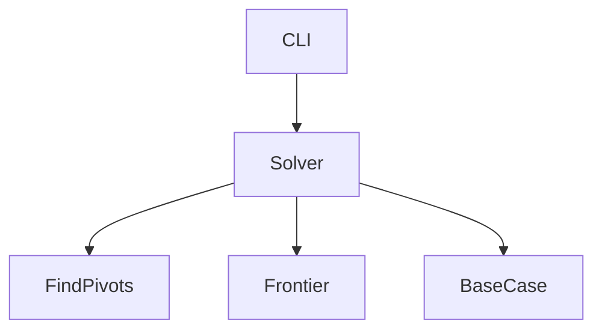
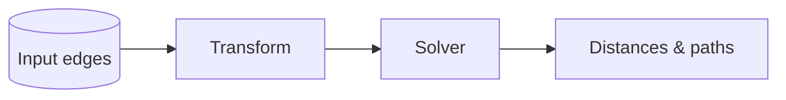

# BMSSP Design

`ssspx` implements a divide‑and‑conquer algorithm inspired by **Balanced
Multi‑source Shortest Paths (BMSSP)**. This page sketches the major moving
parts and the trade‑offs that shaped the implementation.

## Levels

The solver proceeds in *levels*. Each level handles a subproblem consisting of
the current frontier and the yet‑unsettled vertices. Work is split across levels
until the number of unexplored edges falls below a configured bound.

## `FindPivots`

At every level the solver executes `FindPivots` to choose a set of pivot
vertices. Pivots partition the graph so that each subproblem contains roughly
half the remaining edges. The block frontier supplies candidates in order of
non‑decreasing tentative distance.

## Base case

Once a level contains fewer than the edge threshold the solver switches to a
plain Dijkstra scan. This base case guarantees progress even on adversarial
inputs and keeps the recursion shallow.

## Frontier semantics

Two interchangeable frontiers exist:

* **block** – groups vertices by distance range, reducing priority queue
  churn and improving cache locality. This is the default for performance.
* **heap** – a classic binary heap used mainly as a reference
  implementation.

Both frontiers operate on a non‑negative metric and can skip stale entries.

## Call graph

## Data flow

The optional transform clones high‑degree vertices to bound out‑degree, which
in turn feeds the solver. Results include both distances and path
reconstruction metadata.
